# PromptScribe 🚀

## Professional Markdown-Based Prompt Management for AI Workflows

<p align="center">
  
  
  
  
  
</p>

## 📋 Overview

**PromptScribe** is a professional-grade, markdown-enabled prompt management system designed specifically for AI developers, prompt engineers, and content creators. It transforms chaotic prompt collections into organized, searchable, and reusable assets with zero dependencies—just a single HTML file.

> **The problem it solves**: Managing AI prompts across different models and use cases becomes exponentially complex as your library grows. PromptScribe brings order to this chaos with a clean, efficient interface that respects your workflow.

### 🔄 Before vs After PromptScribe

| **Before PromptScribe** | **After PromptScribe** |
|-------------------------|------------------------|
| Prompts scattered across text files and notes apps | Centralized, searchable repository |
| No version control or organization | Categories, tags, and favorites |
| Manual markdown formatting | Built-in markdown editor with live preview |
| No backup or export options | Full JSON export/import with cloud sync potential |
| Difficulty finding specific prompts | Advanced search and filtering |
| No collaboration or sharing features | Easy export in multiple formats |
| Constant context switching between tools | All-in-one solution in browser |

## 🎯 Core Philosophy

PromptScribe operates on a simple principle: **Your prompts are valuable intellectual property.** They deserve the same organizational rigor as your codebase. This tool proves its value by existing—no complicated setup, no subscriptions, just immediate utility.

## 🚀 Get Started in 60 Seconds

### **Quick Start Options**

<table>
<tr>
<td width="33%">

#### **🌐 Web App**
```bash
# Click and use immediately
https://aliriyaj007.github.io/PromptScribe/
```
*Zero installation, works in any modern browser*

</td>
<td width="33%">

#### **📦 Direct Download**
```bash
# Save the HTML file locally
curl -O https://raw.githubusercontent.com/Aliriyaj007/PromptScribe/main/index.html
```
*Works offline, portable, self-contained*

</td>
<td width="33%">

#### **🐙 GitHub Clone**
```bash
# Clone for customization
git clone https://github.com/Aliriyaj007/PromptScribe.git
cd PromptScribe
# Open index.html in browser
```
*Full source access, modify as needed*

</td>
</tr>
</table>

## ✨ Key Features

### **🎨 Intelligent Organization**

```mermaid
graph TD
    A[New Prompt] --> B[Markdown Editor]
    B --> C{Categorize}
    C --> D[General]
    C --> E[Coding]
    C --> F[Creative]
    C --> G[Business]
    
    D --> H[Apply Tags]
    E --> H
    F --> H
    G --> H
    
    H --> I{Status Options}
    I --> J[Favorite ⭐]
    I --> K[Archive 📦]
    I --> L[Trash 🗑️]
    
    J --> M[Search & Filter]
    K --> M
    L --> M
    
    M --> N[Export Options]
    N --> O[.txt]
    N --> P[.md]
    N --> Q[.json]
```


### **📊 Feature Comparison Matrix**

| Feature | PromptScribe | Notes App | Spreadsheet | Specialized Tools |
|---------|--------------|-----------|-------------|-------------------|
| **Markdown Support** | ✅ Live Preview | ⚠️ Basic | ❌ None | ⚠️ Limited |
| **Categorization** | ✅ Color-coded | ⚠️ Folders | ✅ Manual | ✅ Advanced |
| **Search** | ✅ Full-text | ✅ Basic | ⚠️ Limited | ✅ Advanced |
| **Export Formats** | ✅ 3 Formats | ⚠️ 1 Format | ✅ CSV Only | ⚠️ Proprietary |
| **Offline Use** | ✅ Fully | ✅ Yes | ✅ Yes | ❌ Often Cloud |
| **Custom Themes** | ✅ 8 Themes | ❌ None | ❌ None | ⚠️ Limited |
| **Portability** | ✅ Single File | ❌ App Needed | ❌ App Needed | ❌ App Needed |
| **Cost** | ✅ Free | ✅ Free | ✅ Free | 💰 Often Paid |

## 🛠️ Installation & Setup

### **Method 1: GitHub Pages (Recommended)**
```bash
# Simply visit - no installation needed
https://aliriyaj007.github.io/PromptScribe/
```

### **Method 2: Local Deployment**
```bash
# 1. Download the HTML file
wget https://raw.githubusercontent.com/Aliriyaj007/PromptScribe/main/index.html

# 2. Run with any HTTP server
# Python 3
python3 -m http.server 8000

# Or open directly in browser
open index.html  # macOS
start index.html # Windows
xdg-open index.html # Linux
```

### **Method 3: Docker Deployment**
```dockerfile
# Create a simple Dockerfile
FROM nginx:alpine
COPY index.html /usr/share/nginx/html/index.html
EXPOSE 80

# Build and run
# docker build -t promptscribe .
# docker run -p 8080:80 promptscribe
```

## 🎮 Usage Guide

### **1. First Run Workflow**


### **2. Keyboard Shortcuts**

| Shortcut | Action | Context |
|----------|--------|---------|
| `Ctrl + N` | New Prompt | Global |
| `Ctrl + S` | Save Prompt | Editor |
| `Ctrl + B` | Bold Text | Editor |
| `Ctrl + I` | Italic Text | Editor |
| `/` | Focus Search | Global |
| `Esc` | Close Modals | Global |
| `Ctrl + E` | Toggle Preview | Editor |

### **3. Views & Layouts**

<table>
<tr>
<th>Grid View</th>
<th>List View</th>
<th>Kanban View</th>
</tr>
<tr>
<td>

```
Cards organized in
responsive grid
Perfect for visual
browsing
```

</td>
<td>

```
Compact list format
Shows more prompts
per screen
Ideal for search results
```

</td>
<td>

```
Category-based columns
Drag-and-drop ready
Project management style
```

</td>
</tr>
</table>

## 🏗️ Architecture

### **Single-File Architecture**
```
PromptScribe/
├── 📁 (Single File Structure)
│   ├── 🎨 CSS (Embedded)
│   │   ├── Theme System (8 Themes)
│   │   ├── Responsive Design
│   │   └── Dark/Light Mode
│   ├── ⚡ JavaScript (Embedded)
│   │   ├── State Management
│   │   ├── Markdown Parser
│   │   ├── LocalStorage API
│   │   └── Export/Import System
│   └── 📝 HTML5 (Structure)
│       ├── Semantic Markup
│       ├── Accessibility Tags
│       └── Responsive Meta Tags
└── 🗃️ Data (Browser Storage)
    ├── Prompts Collection
    ├── Categories System
    └── User Preferences
```

### **Data Flow**


## 🔧 Advanced Features

### **Theme System**
```javascript
// Available themes in code
const themes = [
    { id: 'ocean', name: 'Ocean Blue', color: '#007bff' },
    { id: 'midnight', name: 'Midnight Purple', color: '#6f42c1' },
    { id: 'forest', name: 'Forest Green', color: '#28a745' },
    { id: 'sunset', name: 'Sunset Orange', color: '#fd7e14' },
    { id: 'slate', name: 'Slate Gray', color: '#6c757d' },
    { id: 'rose', name: 'Rose Pink', color: '#e83e8c' },
    { id: 'amber', name: 'Amber Gold', color: '#ffc107' },
    { id: 'cyber', name: 'Cyber Teal', color: '#00d2d3' }
];
```

### **Export/Import System**
```json
{
  "version": "2.0",
  "exportDate": "2024-01-15T10:30:00Z",
  "prompts": [
    {
      "id": "prompt_123",
      "title": "API Documentation Template",
      "content": "# API Endpoint\n\n**Method**: GET\n\n**URL**: `/api/v1/users`",
      "categoryId": "cat_2",
      "tags": ["api", "documentation", "backend"],
      "isFavorite": true,
      "created": "2024-01-10T14:30:00Z"
    }
  ],
  "categories": [
    {"id": "cat_1", "name": "General", "color": "#6c757d"}
  ]
}
```

## 📈 Performance Metrics

| Metric | Value | Note |
|--------|-------|------|
| **Load Time** | < 100ms | Single file, no dependencies |
| **Storage** | Unlimited* | Browser LocalStorage (5-10MB) |
| **Search Speed** | Instant | Client-side indexing |
| **Export Speed** | < 1s | Direct browser download |
| **Memory Usage** | < 50MB | Lightweight JavaScript |
| **Compatibility** | All browsers | Chrome, Firefox, Safari, Edge |

*Limited by browser storage quotas

## 🚀 Deployment Options

### **Self-Hosting Guide**
```bash
# Option 1: Simple HTTP Server
npm install -g http-server
http-server -p 8080

# Option 2: Nginx Configuration
server {
    listen 80;
    server_name promptscribe.yourdomain.com;
    root /var/www/promptscribe;
    index index.html;
    
    location / {
        try_files $uri $uri/ =404;
    }
}

# Option 3: Cloudflare Pages
# 1. Connect GitHub repo
# 2. Set build command: (none)
# 3. Set output directory: /
# 4. Deploy
```

### **Browser Compatibility**

| Browser | Version | Status |
|---------|---------|--------|
| Chrome | 60+ | ✅ Fully Supported |
| Firefox | 55+ | ✅ Fully Supported |
| Safari | 12+ | ✅ Fully Supported |
| Edge | 79+ | ✅ Fully Supported |
| Mobile Safari | 12+ | ✅ Responsive |
| Chrome Mobile | 60+ | ✅ Responsive |

## 🤝 Contributing

PromptScribe is built for developers, by developers. Contributions are welcome through the standard GitHub workflow:

### **Development Workflow**


### **Areas for Contribution**
- **New Features**: Additional export formats, cloud sync, collaboration features
- **UI/UX**: Improved responsive designs, accessibility enhancements
- **Themes**: Additional color schemes and customization options
- **Integration**: API integrations with AI platforms (OpenAI, Claude, etc.)
- **Documentation**: Improved guides, tutorials, and translations

### **Code Standards**
```bash
# Code style follows:
# - Clean, commented JavaScript
# - Modular CSS with custom properties
# - Semantic HTML5
# - Accessibility (ARIA labels, keyboard nav)
# - No external dependencies unless absolutely necessary
```

## 📚 FAQ

<details>
<summary><strong>Q: Is my data secure?</strong></summary>

**A:** All data stays in your browser's LocalStorage. No data is sent to any server unless you explicitly export it. For cloud backup, export your data and store it securely.

</details>

<details>
<summary><strong>Q: Can I use this offline?</strong></summary>

**A:** Yes! Once loaded, PromptScribe works completely offline. Save the HTML file locally or host it on your local network.

</details>

<details>
<summary><strong>Q: How do I backup my prompts?</strong></summary>

**A:** Use the Export feature (Settings → Data Management) to download a JSON backup. You can import this backup on any device.

</details>

<details>
<summary><strong>Q: Can I customize the categories?</strong></summary>

**A:** Yes, click the + icon next to "Categories" in the sidebar to add new categories with custom colors.

</details>

<details>
<summary><strong>Q: Is there a mobile app?</strong></summary>

**A:** The web app is fully responsive and works on mobile browsers. You can also "Add to Home Screen" on iOS/Android for an app-like experience.

</details>

## 📄 License

PromptScribe is released under the **MIT License**, giving you freedom to use, modify, and distribute the software with minimal restrictions.

```
MIT License

Copyright (c) 2024 Riyajul Ali

Permission is hereby granted, free of charge, to any person obtaining a copy
of this software and associated documentation files (the "Software"), to deal
in the Software without restriction, including without limitation the rights
to use, copy, modify, merge, publish, distribute, sublicense, and/or sell
copies of the Software, and to permit persons to whom the Software is
furnished to do so, subject to the following conditions:

The above copyright notice and this permission notice shall be included in all
copies or substantial portions of the Software.
```

## 👨‍💻 Author & Contact

**Riyajul Ali** – Senior Developer & Open Source Maintainer

| Platform | Link | Purpose |
|----------|------|---------|
| **GitHub** | [Aliriyaj007](https://github.com/Aliriyaj007) | Code, Issues, Contributions |
| **Email** | aliriyaj007@protonmail.com | Security issues, Private inquiries |
| **LinkedIn** | [Aliriyaj007](linkedin.com/in/Aliriyaj007) | Professional networking |
| **Web App** | [Live Demo](https://aliriyaj007.github.io/PromptScribe/) | Try it now |
| **Source Code** | [GitHub Repo](https://github.com/Aliriyaj007/PromptScribe) | Download, Fork, Star |

## 🌟 Support the Project

If you find PromptScribe useful, consider:

1. **Star the repository** – Helps with visibility
2. **Share with colleagues** – Spread the word
3. **Report issues** – Help improve the tool
4. **Contribute code** – Add features you need
5. **Use it daily** – The best validation

---

<div align="center">
  
**"Organize your thoughts, amplify your output."**

*PromptScribe – Because your next great idea shouldn't get lost in a sea of text files.*

[](https://star-history.com/#Aliriyaj007/PromptScribe&Date)

</div>
